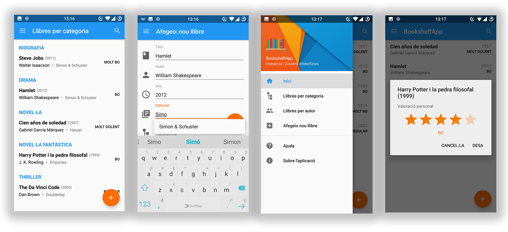

# BookshelfApp

*BookshelfApp* is an Android app developed by [Iván de Mingo](https://www.github.com/IvanDeMingo) and [Arnau Blanch](https://www.github.com/ArnauBlanch) as a project for the subject *Interaction and Interface Design* during our degree in Computer Science at the Polytechnical University of Catalonia (UPC).

It was our first ever Android app and the intention of the project was focusing on having a good interaction. The app is a book database which lets you view the list of books (by title, author and category), add new books, edit the personal evaluation and delete books.

### Screenshots

